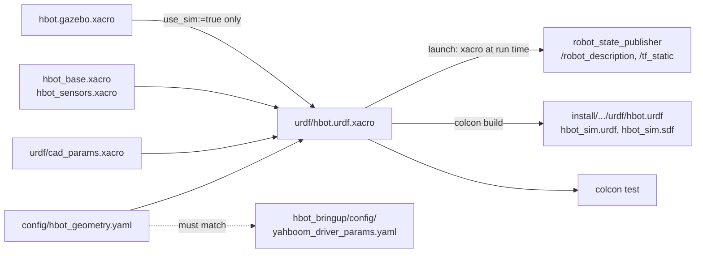

# hbot_description

Robot model (URDF/xacro, meshes, geometry config) for HBOT, shared by the real robot and the Gazebo simulation.

## Contents

- [HBOT robot description: one model for the real robot and Gazebo](#hbot-robot-description-one-model-for-the-real-robot-and-gazebo)
- [Building the HBOT model from CAD meshes](#building-the-hbot-model-from-cad-meshes)

---

## HBOT robot description: one model for the real robot and Gazebo

This guide walks through how `hbot_description` is organised, why it is
organised this way, and what to run when you change it. It replaces the
previous two-URDF workflow (`hbot.urdf` with frames only + `hbot_sim.urdf`
with `sim:=true`, both written into `src/` by the build).

How the CAD becomes meshes and `cad_params.xacro` is covered separately in
[CAD meshes](#building-the-hbot-model-from-cad-meshes).

Branch: `feat/standard-description` in `hbot_description`.

---

### 0. The result at a glance

```
hbot_description/
  config/
    hbot_geometry.yaml        EDIT  every robot dimension (track, poses, masses, lidar spec)
  urdf/
    hbot.urdf.xacro           EDIT  the single entry point; args use_sim, driver_joint_states
    hbot_base.xacro           EDIT  base_footprint, base_link, wheels, caster
    hbot_sensors.xacro        EDIT  laser, imu_link
    hbot.gazebo.xacro         EDIT  Gazebo only: sensor plugins, diff-drive, friction
    inertials.xacro, materials.xacro    helpers
    cad_params.xacro          GENERATED by scripts/prepare_meshes.py (committed)
  meshes/*.stl                GENERATED by scripts/prepare_meshes.py (committed)
  launch/
    description.launch.py     robot_state_publisher (include this from bringup)
    view.launch.py            + joint_state_publisher + RViz
    hbot_description.launch.py  deprecated wrapper (old `sim:=` arg)
  test/test_description.py    colcon test: parity + drift checks
  CMakeLists.txt              also generates hbot.urdf / hbot_sim.urdf(.sdf) into build/
```



| | real robot (`use_sim:=false`, default) | Gazebo (`use_sim:=true`) |
|---|---|---|
| Links | `base_footprint`, `base_link`, `left/right_wheel_link`, `front_caster`, `laser`, `imu_link` | same |
| Visuals, collisions, inertias | yes (CAD meshes, primitives) | same |
| Wheel joints | `fixed` (the driver publishes no `/joint_states` yet) | `continuous` |
| `<gazebo>` sensors, diff-drive, friction | no | yes |
| Wheel track / laser pose | from `hbot_geometry.yaml` | the same values |

---

### Step 1: Why this layout (what "standard" means here)

The previous flow worked but had four problems:

1. Sim and real were interleaved with `xacro:if` blocks throughout one file.
2. The build wrote `hbot.urdf` / `hbot_sim.urdf` into `src/`, so generated
   files ended up in git, and root-owned Docker builds polluted the source.
3. Dimensions lived in several places and had already drifted: `0.195` in the
   xacro, `wheel_track: 0.2` in the driver params, `0.08 0 0.14` for the
   laser in older docs.
4. The real-robot URDF was frames only, so RViz on the robot showed no model.

The new layout follows what most ROS 2 robot packages do (e.g. Universal
Robots' `ur_description`, Clearpath, Husarion, TurtleBot 4):

| Convention | Here |
|---|---|
| One `<robot>_description` package with `urdf/ meshes/ launch/ config/ rviz/` | yes |
| **One** entry xacro, sim vs. real selected by an argument | `hbot.urdf.xacro use_sim:=…` |
| The model split into macro files; Gazebo tags in a separate `*.gazebo.xacro` | `hbot_base`, `hbot_sensors`, `hbot.gazebo` |
| Physical parameters in YAML, loaded with `xacro.load_yaml()` | `config/hbot_geometry.yaml` (UR does the same with `physical_parameters.yaml`) |
| The real robot gets the full model (visuals, collisions, inertias) | yes |
| xacro expanded **at launch**, generated URDFs not committed | `description.launch.py`; `.gitignore` |
| Tests on the expanded xacro | `test/test_description.py` |

Two deliberate deviations:

- **Plain URDF files are still generated too**, into the build directory, and
  installed to `share/hbot_description/urdf/`. `hbot_bringup` and
  `hbot_simulation` currently read `hbot.urdf` / `hbot_sim.urdf`, so they keep
  working unchanged; they can move to `description.launch.py` later
  (Step 8). It also means the Pi does not have to run xacro at start-up.
- **Wheels are `fixed` on the real robot** until the driver publishes
  `/joint_states` (Step 9). A continuous joint without a joint state has no TF.

### Step 2: Put the numbers in `config/hbot_geometry.yaml`

Every dimension is in one YAML. An entry is either `cad`, meaning "take the
value measured from the CAD" (`cad_params.xacro`), or a number measured on the
robot:

```yaml
wheels:
  track: 0.190        # tyre centre to tyre centre, measured on the robot (CAD: 0.1827)
  radius: cad         # 0.0337 in the CAD
laser:
  x: cad
  z: cad
  yaw: 0.0            # set to 3.14159 if /scan appears rotated 180 deg
lidar_sensor:
  rate: 8.0
  samples: 375
```

The entry xacro loads it and resolves `cad`:

```xml
<xacro:include filename="cad_params.xacro"/>
<xacro:property name="geo" value="${xacro.load_yaml('../config/hbot_geometry.yaml')}" lazy_eval="false"/>
<xacro:property name="wheel_separation"
                value="${cad_wheel_separation if geo.wheels.track == 'cad' else geo.wheels.track}"/>
```

Two details that matter:

- The path `../config/...` is **relative to the xacro file**, so it works from
  `src/`, from `install/share/`, and on the Pi. (`$(find hbot_description)`
  would fail during the package's own build, before it is installed.)
- `lazy_eval="false"` loads the YAML once, when the property is defined.

### Step 3: Split the model into macro files

`hbot.urdf.xacro` only declares the arguments, resolves the parameters, and
instantiates macros:

```xml
<xacro:arg name="use_sim" default="false"/>
<xacro:arg name="driver_joint_states" default="false"/>
<!-- xacro args are strings ("false" is truthy in Python): convert once -->
<xacro:property name="use_sim" value="${'$(arg use_sim)'.lower() in ('true', '1')}"/>
...
<xacro:hbot_base/>
<xacro:wheel prefix="left_wheel"  y_reflect="1"  mesh_yaw="0"/>
<xacro:wheel prefix="right_wheel" y_reflect="-1" mesh_yaw="${pi}"/>
<xacro:caster/>
<xacro:laser_sensor/>
<xacro:imu_sensor/>
<xacro:if value="${use_sim}">
  <xacro:include filename="hbot.gazebo.xacro"/>
</xacro:if>
```

| File | Contains | Real | Sim |
|---|---|---|---|
| `hbot_base.xacro` | `base_footprint`, `base_link` (mesh visual, box collision, inertia), wheels, caster | ✓ | ✓ |
| `hbot_sensors.xacro` | `laser` (mesh, cylinder), `imu_link` + their joints | ✓ | ✓ |
| `hbot.gazebo.xacro` | gz sim: caster friction, `gpu_lidar` + IMU sensors, DiffDrive + JointStatePublisher systems | – | ✓ |

The only sim/real difference inside the shared files is the wheel joint type:

```xml
<xacro:property name="wheel_joint_type"
                value="${'continuous' if (use_sim or driver_joint_states) else 'fixed'}"/>
```

`hbot_body.xacro` from the previous layout is gone: its content moved into
`hbot_base.xacro` and `hbot_sensors.xacro`.

### Step 4: Build (URDFs go to `build/`, never to `src/`)

`CMakeLists.txt` generates the plain files with `add_custom_command`, so they
are rebuilt whenever a `.xacro` or `config/*.yaml` changes:

```cmake
add_custom_command(
  OUTPUT ${HBOT_GEN_DIR}/hbot_sim.urdf
  COMMAND ${XACRO} ${HBOT_XACRO} use_sim:=true -o ${HBOT_GEN_DIR}/hbot_sim.urdf
  DEPENDS ${HBOT_XACRO_DEPS})
...
install(FILES ${HBOT_GENERATED} DESTINATION share/${PROJECT_NAME}/urdf)
```

- `HBOT_GEN_DIR` is `build/hbot_description/urdf/`.
- `hbot_sim.sdf` is only produced when `ign` or `gz` exists (the Pi image has no Gazebo).
- `package.xml` declares `<build_depend>xacro</build_depend>`, so `rosdep`
  installs it in the `docker/pi` image.
- `.gitignore` lists `urdf/hbot.urdf`, `urdf/hbot_sim.urdf` and `urdf/*.sdf`.

```bash
cd ~/Documents/03.MyProjects/hbot_ws
./build_packages.sh hbot_description
ls install/hbot_description/share/hbot_description/urdf/   # hbot.urdf, hbot_sim.urdf, hbot_sim.sdf, *.xacro
```

To inspect the output without building:

```bash
cd src/hbot_description/urdf
bash -c 'source /opt/ros/humble/setup.bash && xacro hbot.urdf.xacro              | check_urdf /dev/stdin'
bash -c 'source /opt/ros/humble/setup.bash && xacro hbot.urdf.xacro use_sim:=true | check_urdf /dev/stdin'
```

### Step 5: Launch

**`description.launch.py`**: `robot_state_publisher` with the xacro expanded at
launch. This is what other packages should include:

```bash
ros2 launch hbot_description description.launch.py                   # real robot
ros2 launch hbot_description description.launch.py use_sim:=true     # Gazebo model (use_sim_time follows use_sim)
```

**`view.launch.py`**: the model in RViz, no robot or Gazebo needed:

```bash
ros2 launch hbot_description view.launch.py                    # real-robot model
ros2 launch hbot_description view.launch.py use_sim:=true      # Gazebo model + joint_state_publisher
ros2 launch hbot_description view.launch.py use_sim:=true gui:=true   # wheel sliders
```

`use_sim:=true` needs `joint_state_publisher` (and `gui:=true` needs
`joint_state_publisher_gui`). They are not installed on the dev laptop at the
moment:

```bash
sudo apt install ros-humble-joint-state-publisher ros-humble-joint-state-publisher-gui
```

The old `hbot_description.launch.py sim:=true rviz:=true` still works; it
forwards to `view.launch.py`.

### Step 6: Test

```bash
./build_packages.sh hbot_description
source install/setup.bash
colcon test --packages-select hbot_description --event-handlers console_direct+
colcon test-result --verbose
```

`test/test_description.py` checks:

| Test | Catches |
|---|---|
| `test_tree_is_valid` | a joint pointing at a missing link; more than one root |
| `test_real_and_sim_have_the_same_frames` | any link or joint origin that differs between real and sim (the TF the Pi publishes ≠ the TF Gazebo uses) |
| `test_gazebo_tags_only_in_sim` | Gazebo content leaking into the real model |
| `test_wheel_joint_types` | wheels continuous on the robot without joint states |
| `test_wheel_track_matches_geometry` | wheel joints / diff-drive `wheel_separation` / `wheel_diameter` not matching the YAML |
| `test_lidar_matches_geometry` | Gazebo ray sensor not matching `lidar_sensor` |
| `test_scan_plane_clears_the_body` | chassis collision box reaching the scan plane (self-hits in sim) |
| `test_meshes_exist` | a `package://` mesh that isn't in `meshes/` |
| `test_driver_wheels_match` | `yahboom_driver_params.yaml` `wheel_track` / `wheel_diameter` ≠ `hbot_geometry.yaml` (skipped when `hbot_bringup` isn't built) |

### Step 7: Validation results (2026-09-25)

Built in a separate build/install base (`colcon build --symlink-install`),
Humble, host laptop:

- `check_urdf`: both variants parse, root `base_footprint` → `base_link` →
  `front_caster, imu_link, left_wheel_link, laser, right_wheel_link`.
- Compared element by element with the previous `hbot_sim.urdf`: the **only**
  changes are the track (wheels at y ±0.095 instead of ±0.0975, diff-drive
  `wheel_separation` 0.19 instead of 0.195) and number formatting (`8` → `8.0`).
- Nothing is written to `src/hbot_description/urdf/`; the generated files are
  in `build/hbot_description/urdf/` and linked from `install/`.
- `colcon test`: 8 passed, 1 skipped (driver check, `hbot_bringup` not in that
  install). With the workspace `install/` sourced, the driver check **failed as
  intended** (`wheel_track=0.2` vs `wheels.track=0.19`). After the
  `hbot_bringup` update (Step 9): 9 passed.
- `description.launch.py` on `ROS_DOMAIN_ID=42`: `base_footprint→left_wheel_link
  (0, 0.095, 0.034)`, `base_footprint→laser (0.043, 0, 0.137)`, published as
  static TF with fixed wheels.
- `view.launch.py use_sim:=true joint_state_publisher:=false rviz:=false`:
  `/robot_description` contains the diff-drive plugin, `base_link→laser`
  unchanged. With the default `joint_state_publisher:=true` the launch fails on
  this laptop only because the package isn't installed (Step 5).
- Not run here: Gazebo (`dev_sim_smoke.sh`) and the Pi. `hbot_sim.urdf` is
  identical apart from the track, but run the smoke test after merging.

### Step 8: Which file do I edit? ("I changed X, what do I run?")

| Change | Edit | Then run |
|---|---|---|
| A measured dimension (track, laser pose, IMU pose, mass) | `config/hbot_geometry.yaml` | build → `colcon test` → sim smoke; for the wheels also the driver params (Step 9) |
| Lidar spec in sim (rate, samples, range, noise) | `config/hbot_geometry.yaml` `lidar_sensor` | build → sim smoke |
| A new link / sensor frame (camera, bumper) | new macro in `hbot_sensors.xacro`, instantiate it in `hbot.urdf.xacro` | build → test |
| Its Gazebo sensor/system | `hbot.gazebo.xacro` (+ a topic entry in `hbot_simulation/config/gz_bridge.yaml`) | build → sim smoke |
| Colour of a part | the `<material name="…"/>` of the link's `<visual>` (colours in `materials.xacro`); sdformat turns it into the gz sim material, so RViz and Gazebo always match. `base_link` is blue in both | build → restart Gazebo (a running sim keeps the spawned model) |
| Sim-only physics (friction, torque, update rates) | `hbot.gazebo.xacro` | build → sim smoke (the real robot is not affected) |
| CAD re-export | `models/*.stl` → `scripts/prepare_meshes.py --preview …` ([CAD meshes](#building-the-hbot-model-from-cad-meshes) Step 7) | build → test |
| Deploy | nothing extra | `deploy-to-pi`; `hbot.urdf` is built from the same xacro |

Smoke tests: `ROS_DOMAIN_ID=42 ./scripts/dev_sim_smoke.sh 35` (a private domain,
because the script publishes `/cmd_vel`).

### Step 9: Follow-ups outside this package

Done on `feat/standard-description` in `hbot_bringup` (see
[`hbot_bringup/README.md`](../hbot_bringup/README.md)):

1. **Driver wheels = model wheels.** `yahboom_driver_params.yaml` now has
   `wheel_track: 0.19` (was 0.2) and `wheel_diameter` = 2 × `wheels.radius`
   once the radius is measured. With the old 0.2 track, odometry under-reported
   every turn by ~5 % and the robot turned ~5 % more than `/cmd_vel` asked.
   `test_driver_wheels_match` fails whenever the two files drift apart
   (`cad` entries are not compared).
2. **`hbot_bringup` uses launch-time xacro.** `hbot_bringup.launch.py`
   (real-robot mode) includes `description.launch.py` with `use_sim:=false`
   instead of reading `urdf/hbot.urdf`. The Pi needs `ros-humble-xacro` at run
   time (an `exec_depend`, installed by `rosdep`).

Still open:

3. **`hbot_simulation` to launch-time xacro (optional).** In
   `hbot_house.launch.py`, replace the reading of `urdf/hbot_sim.urdf` and
   the `robot_state_publisher` node with:

   ```python
   IncludeLaunchDescription(
     PythonLaunchDescriptionSource(os.path.join(
       get_package_share_directory('hbot_description'), 'launch', 'description.launch.py')),
     launch_arguments={'use_sim': 'true', 'use_sim_time': use_sim_time}.items())
   ```

   `ros_gz_sim create -topic robot_description` stays as is. Until then it keeps
   using the installed `hbot_sim.urdf`, which this package still generates.
4. **Wheel joint states from the C++ driver.** Once `hbot_driver` publishes
   `/joint_states` for `left_wheel_joint` / `right_wheel_joint`, launch with
   `driver_joint_states:=true` so the wheels turn in RViz.
5. **`ros2_control` (later).** The common next step: a `<ros2_control>` tag
   whose hardware plugin is the Rosmaster driver on the robot and
   `gz_ros2_control` in sim, with the same `diff_drive_controller` config
   in both. That removes the separate diff-drive parameters entirely.
6. ~~**Gazebo Classic is end-of-life (Jan 2025).**~~ Done on `feat/gz-sim`:
   the sim runs on gz sim (Fortress via `ros-humble-ros-gz`); only
   `hbot.gazebo.xacro`, the world and the sim launch changed. See
   [`hbot_simulation/README.md`](../hbot_simulation/README.md#migrating-the-hbot-simulation-from-gazebo-classic-to-gazebo-sim-gz-sim).
7. **Nav2 footprint.** `nav2_params.yaml` still uses a centred box
   (±0.09 × ±0.12 m); the robot extends from x −0.05 to +0.132 of the axle.

---

## Building the HBOT model from CAD meshes

This guide explains, step by step, how the CAD exports in
[`models/`](models) (`base_link.stl`: chassis + caster + lidar, and
`wheel.stl`: one drive wheel) become the link-frame meshes in `meshes/` and the
measured dimensions in `urdf/cad_params.xacro`. It also covers what to do when
the CAD changes.

How those meshes and dimensions are assembled into the robot description
(xacro layout, `config/hbot_geometry.yaml`, the real vs. Gazebo variants,
launch files, tests) is in [Robot description](#hbot-robot-description-one-model-for-the-real-robot-and-gazebo).

---

### 0. Result at a glance

| Item | Value | Source |
|---|---|---|
| Frame origin (`base_footprint` ≡ `base_link`) | on the ground, under the drive-axle mid-point | convention |
| Wheel Ø × width | 67.4 × 30.6 mm | CAD |
| Wheel track | CAD 0.183 m; the model uses **0.190 m** (measured, `config/hbot_geometry.yaml`) | measured |
| Caster ball | r 11.6 mm at x +105 mm, y +10 mm | CAD |
| Lidar | YDLidar X3, `laser` at x +42.5 mm, z 136.8 mm (scan plane) | CAD |
| Chassis collision box | x −0.050…+0.132, y ±0.090, z 0.024…0.117 m | CAD |

```
                 +x (forward)
                   ^
          caster o |            laser (+0.0425, 0, 0.137)
                   |    [X3]
   left wheel ||   +---->  ...  || right wheel      y: +0.095 / -0.095
                   |
             base_footprint (0,0,0) = axle mid-point on the ground
```

Files covered by this guide:

| File | Role |
|---|---|
| `models/*.stl` | raw CAD exports (mm, CAD frame); the **input**, don't edit by hand |
| `scripts/prepare_meshes.py` | turns `models/` into `meshes/` + `urdf/cad_params.xacro` |
| `meshes/{base_link,wheel,lidar}.stl` | link-frame meshes in metres (generated, committed: the URDF loads them) |
| `urdf/cad_params.xacro` | measured dimensions as xacro properties (generated, committed) |

---

### Step 1: Inspect the raw STLs

Before using a CAD mesh in a URDF you need three facts about it: its **units**,
its **coordinate frame**, and **what it contains**.

```bash
python3 - <<'EOF'
import numpy as np
d = open("models/base_link.stl", "rb").read()
n = int(np.frombuffer(d[80:84], "<u4")[0])
v = np.frombuffer(d[84:], dtype=[("n","<3f4"),("v","<9f4"),("a","<u2")], count=n)["v"].reshape(-1,3)
print(n, "triangles; min", v.min(0), "max", v.max(0))
EOF
```

What this showed:

- **Binary STL, millimetres.** The chassis bounding box is ~230 × 229 × 145.
  URDF works in metres, so everything gets scaled by 0.001.
- **Not in a robot frame.** The coordinates are around (280, −227, 113), far from
  the origin. The ~square bounding box for a non-square robot means the
  model is also **rotated about Z**. The wheel looks round from every axis,
  which confirms its axle isn't aligned with X or Y.
- **`base_link.stl` also holds the caster ball and the lidar.** Only the drive
  wheel is a separate file (one wheel; the other is its mirror).

### Step 2: Find the CAD yaw from the wheel axle

A wheel is mostly two large flat side faces, so if you add up the face normals
weighted by area (`Σ area·n·nᵀ`), one eigenvector stands out: the **axle
direction**. For this CAD it points 37.4° from the X axis (the base walls'
normals agree), so the whole assembly is yawed. The body frame is then:

- `y` (left)  = −axle direction, oriented so the exported wheel is the **left** one
- `x` (forward) = z × axle, oriented toward the caster (the chassis extends
  132 mm in front of the axle and only 50 mm behind it)
- `z` = up (the axle is horizontal, which the script checks)

This is a proper rotation (determinant +1). The script builds it, so no mesh
gets mirrored.

### Step 3: Pick the origin (`base_footprint`)

REP-105 puts `base_footprint` on the ground under the robot's rotation
centre. For a differential drive that is the **mid-point of the drive axle**:

- **ground** = the lowest point of the wheel (it matches the caster bottom, so the
  CAD sits level),
- **axle x / z** = the wheel's centre in the side view,
- **y = 0** at the chassis symmetry plane. Reflecting the chassis about that plane
  matches it to within 0.05 mm, and the lidar head centre lies on it too.

`base_link` stays coincident with `base_footprint`, as it always has on the real
robot and in the Nav2/driver configs.

### Step 4: Measure the parts

All of these are computed by the script in the body frame:

- **Wheel:** radius = half its height (33.7 mm); width along the axle (30.6 mm);
  tyre mid-plane = the mean `y` of the points at maximum radius. In the CAD
  the wheels sit at a track of 182.7 mm.
- **Caster:** the only chassis part touching the floor. The fit is seeded from the
  floor-contact points, then a sphere is fitted to the ball's lower half (the
  bracket posts around it are excluded) → r 11.6 mm at (105, 10) mm.
  It is ~10 mm left of centre in the CAD; that's kept as modelled.
- **Lidar:** the D-shaped X2/X3 housing with its round head on the top plate.
  A circle fit on the head's top rim gives its centre (x 42.5 mm, y 0,
  Ø 63 mm). The scan plane is set 8 mm below the head top (the optical
  window is midway up the rotating turret) → z 136.8 mm. Tune
  `SCAN_PLANE_BELOW_TOP` in the script if you measure the real height.
- **Chassis collision box:** the bounds of the chassis without the caster and lidar.
  Its top (0.117 m) must stay **below the scan plane** (0.137 m), otherwise
  the simulated lidar sees the robot's own body as a ring of obstacles.

### Step 5: Split and re-export the meshes in link frames

Each mesh is written in **its own link frame**, in metres, so the URDF
`<visual>` origins are all zero:

| Mesh | Frame | Notes |
|---|---|---|
| `meshes/base_link.stl` | `base_link` | chassis + caster ball; lidar removed |
| `meshes/lidar.stl` | `laser` | triangles inside the lidar box, above the top plate |
| `meshes/wheel.stl` | wheel centre, axle on +y | the left wheel; the right uses the same mesh turned 180° about z |

Run it (numpy only; matplotlib for the preview):

```bash
cd src/hbot_description
python3 scripts/prepare_meshes.py --preview ../../log/hbot_cad_preview.png
```

It prints every measured value and writes `urdf/cad_params.xacro`. **Always
look at the preview** (top / side / front views, the red × is `laser`) to
check that x points to the caster, the lidar (orange) is split cleanly, and the
wheels are on the correct sides.


### Step 6: Hand the measurements to the description

`cad_params.xacro` only defines properties (`cad_wheel_radius`,
`cad_laser_x`, ...). They reach the model through
[`config/hbot_geometry.yaml`](config/hbot_geometry.yaml): every entry set to
`cad` takes the matching CAD value, and a number overrides it with a
measurement from the real robot. The wheel track is such an override (0.190 m
measured vs. 0.183 m in the CAD). The chassis collision box and the lidar
cylinder always come straight from the CAD bounds.

Design choices made at this step (details in
[Robot description](#hbot-robot-description-one-model-for-the-real-robot-and-gazebo)):

1. **Visuals = meshes, collisions = primitives.** Box for the chassis,
   cylinders for the wheels and lidar, a sphere for the caster. A 58k-triangle
   mesh as a collision shape would slow Gazebo down for no benefit.
2. **The caster link has no visual.** The ball is already in `base_link.stl`;
   the link only carries the contact sphere.
3. **`laser` is the lidar frame**, the same `frame_id` the ydlidar driver stamps
   on `/scan` (`ydlidar_ros2_driver/params/ydlidar_x3.yaml`).

### Step 7: When the CAD changes

1. Re-export `base_link.stl` and `wheel.stl` (binary STL, mm, same assembly
   frame for both) into `models/`.
2. `python3 scripts/prepare_meshes.py --preview ../../log/hbot_cad_preview.png`
   and check the preview.
3. If the lidar moved or changed size, adjust `LIDAR_BOX` in the script.
4. Review `config/hbot_geometry.yaml`: an override (e.g. `wheels.track`) is not
   updated by the script.
5. Rebuild and test, see [Robot description](#hbot-robot-description-one-model-for-the-real-robot-and-gazebo) Step 6:

   ```bash
   ./build_packages.sh hbot_description
   colcon test --packages-select hbot_description --event-handlers console_direct+
   ```
